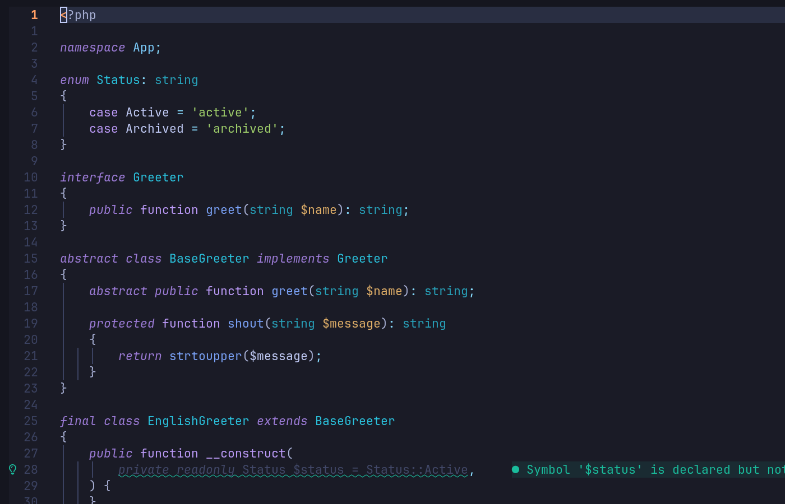
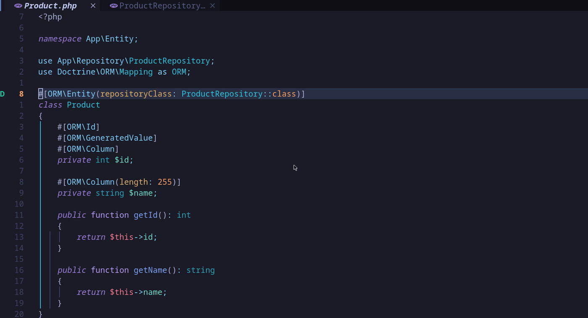
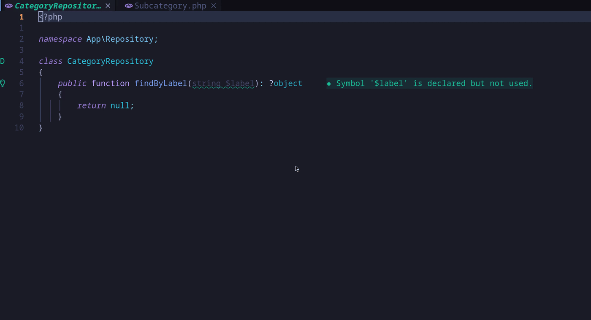
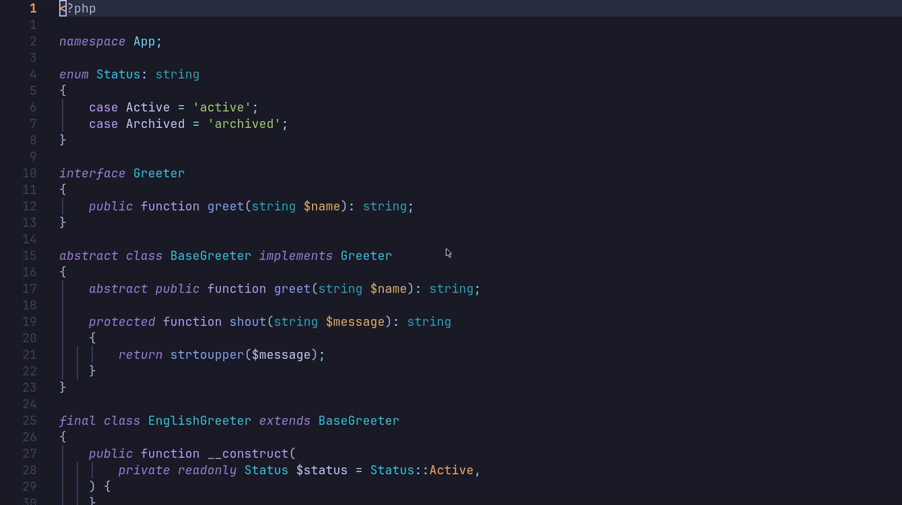
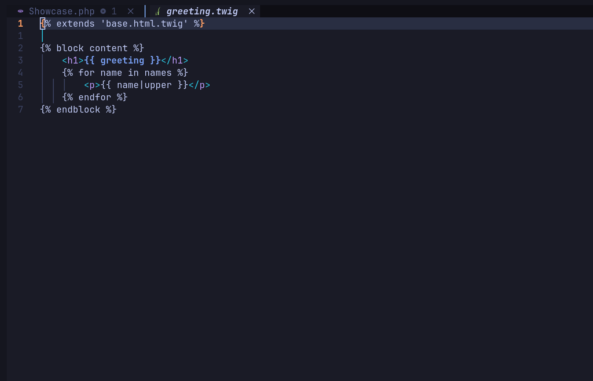
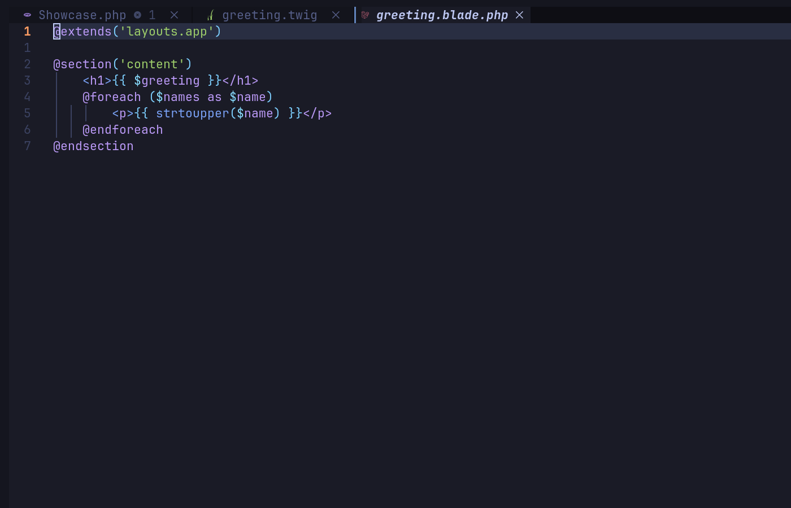
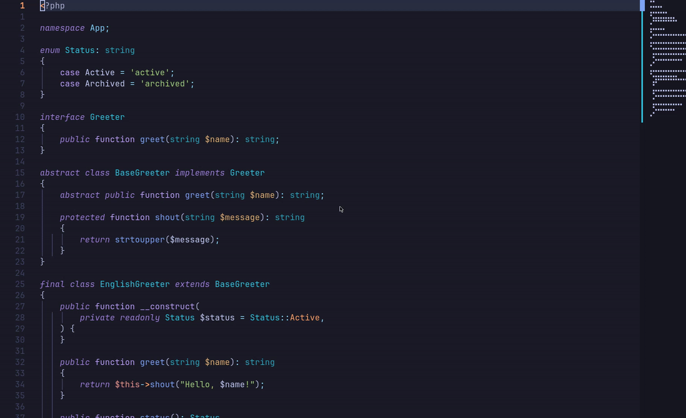

# LazyVim for PHP

#### [Features](#-features) • [Screenshots](#-screenshots) • [Install](#-getting-started) • [Docs](#-configuration)

[](LICENSE)
[](https://github.com/LazyVim/LazyVim)


A [LazyVim](https://github.com/LazyVim/LazyVim) config for PHP (Symfony/Laravel)
and Vue/TypeScript development, built on the stock starter template. Docker-aware
throughout: linting, formatting, testing, and debugging all run inside whichever
container actually owns the file you're editing — not whatever happens to be on
your host.

## ✨ Features

- 🐘 Full PHP LSP stack — Intelephense (completion/hover/diagnostics/references) +
  Phpactor (refactor engine only) + treesitter highlighting, with per-project PHP
  version detection so a multi-project setup doesn't get one project's syntax
  rules applied to another's
- 🟢 PhpStorm-style gutter glyphs — green/blue markers showing when a method
  implements an interface or overrides a parent class, navigable with a keymap
- 🎼 Symfony support — Docker-aware `bin/console` picker resolved through the
  same container-detection logic as linting/formatting/testing, entity ↔
  repository navigation (jump from an entity's `repositoryClass` attribute
  straight to its repository, and back), and `symfony/phpunit-bridge`'s
  different `bin/phpunit` invocation handled automatically
- 🐘 Laravel support (Artisan/routes/make pickers, Tinker, Eloquent completion)
  that loads automatically for any project with an `artisan` file
- 🖋️ Real Twig and Blade syntax highlighting (treesitter has no grammar for
  either, so both use a lazy-load-safe legacy syntax plugin)
- 🖖 Vue + TypeScript via LazyVim's official extra, with Docker-aware
  ESLint/Prettier hand-rolled on top since LSP-based linting can't be resolved
  per-container the way a one-shot CLI tool can
- 🗂️ A project/worktree switcher — one picker across every repo under
  `~/projects` and their git worktrees, same-tab or new-tab
- ⌨️ PhpStorm-parity keymaps (go to definition, jumplist navigation, signature
  help, refactor menu, multi-cursor, class scaffolding)

## 📸 Screenshots

### PHP: highlighting, LSP, signature help



### Implements/overrides gutter glyphs

Green marks a method satisfying an abstract requirement (an interface method,
or an abstract parent method); blue marks overriding a concrete parent method.
A keymap on the glyphed line jumps straight to the interface/parent
declaration it points to.

### Doctrine entity ↔ repository navigation

An entity's `#[ORM\Entity(repositoryClass: ...)]` attribute gets the same
treatment — jump forward from the entity to its repository:



...and back from the repository to the entity/entities that declare it. When
more than one entity shares a repository, a picker shows every match:



### Symfony

Docker-aware `bin/console` picker (`<leader>sc`, see [`lua/util/symfony.lua`](lua/util/symfony.lua))
— resolved through the same container-detection logic as everything else,
so it runs the right `bin/console` whether the project runs in Docker or
not. `bin/phpunit` (Symfony's own PHPUnit wrapper) is preferred over
`vendor/bin/phpunit` when present.



Twig gets real syntax highlighting via [`nelsyeung/twig.vim`](https://github.com/nelsyeung/twig.vim)
— treesitter has no Twig grammar, so this is a legacy syntax plugin,
eager-loaded (see the comment in [`lua/plugins/symfony.lua`](lua/plugins/symfony.lua)
for why `ft=`-based lazy-loading doesn't work for this class of plugin).



### Laravel

[`laravel.nvim`](https://github.com/adalessa/laravel.nvim) (Artisan/routes/make
pickers, Tinker, Eloquent completion) loads automatically for any project
with an `artisan` file — no config needed per project.

Blade gets the same syntax-highlighting treatment as Twig, via
[`jwalton512/vim-blade`](https://github.com/jwalton512/vim-blade) — Neovim
already resolves `*.blade.php` to filetype `blade` on its own, but there's
no treesitter grammar for it either.



### Project & worktree switcher

`<leader>fp` opens a Telescope picker listing every repo under `~/projects`
plus their worktrees (`git worktree list`, not a directory-naming guess —
works across nested, `_worktrees`-nested, and sibling-directory
conventions). `<CR>` opens the selection in the current tab, `Ctrl+T` opens
it in a new tab. `:WorktreeCreate {branch}` / `:WorktreeCreate! {branch}`
creates and opens a new worktree, current tab or new tab.



See [`docs/architecture.md`](docs/architecture.md) for exactly how Docker
resolution and project/worktree discovery work, and
[`docs/customizing-multi-project.md`](docs/customizing-multi-project.md)
for adapting this to your own multi-project setup.

## ⌨️ Keymap cheat-sheet

The headline custom bindings — full reference in
[`docs/keymaps.md`](docs/keymaps.md).

| Key | Action |
| --- | --- |
| `Ctrl+B` | Go to definition |
| `Alt+Left` / `Alt+Right` | Jump back / forward through the jumplist |
| `Ctrl+Space` (insert) | Signature help |
| `Ctrl+E` | Recent/open buffers (plain list) |
| `Ctrl+P` | Global file search |
| `Alt+Insert` | New PHP class/interface/trait/enum |
| `Alt+F6` | Refactor menu (rename / move class) |
| `Alt+J` | Multi-cursor: select next occurrence |
| `<leader>ci` | Jump to the interface/parent method a glyphed method implements/overrides |
| `<leader>cd` | Doctrine entity ↔ repository navigation |
| `<leader>fp` | Project & worktree picker |
| `<leader>sc` | Symfony console picker |
| `:WorktreeCreate {branch}` | Create + open a worktree (`!` = new tab) |

## 📦 Requirements

- Neovim (see [LazyVim's own requirements](https://github.com/LazyVim/LazyVim#-requirements))
- `git`, for the project/worktree switcher
- `docker` / `docker compose`, for the Docker-aware tooling — everything
  still works without it, just against your host PHP instead of a container

## 🚀 Getting Started

```sh
git clone git@github.com:Bakhtarian/nvim-php-lazyvim.git ~/.config/nvim
nvim
```

Everything else installs itself via [lazy.nvim](https://github.com/folke/lazy.nvim)
on first launch.

## 📂 File Structure

```
~/.config/nvim
├── init.lua
├── lua
│   ├── config
│   │   ├── autocmds.lua
│   │   ├── keymaps.lua
│   │   ├── lazy.lua
│   │   └── options.lua
│   ├── plugins
│   │   ├── php.lua                    -- LSP, linting, formatting, testing, DAP
│   │   ├── php-method-glyphs.lua      -- implements/overrides gutter glyphs
│   │   ├── php-doctrine-repository.lua -- Doctrine entity/repository glyphs
│   │   ├── php-keymaps.lua            -- PhpStorm-style refactor/scaffolding keymaps
│   │   ├── symfony.lua                -- bin/console picker + Twig
│   │   ├── laravel.lua                -- laravel.nvim + Blade
│   │   ├── projects.lua               -- project/worktree switcher
│   │   └── ...
│   └── util
│       ├── docker.lua                 -- Docker Compose service resolution
│       ├── symfony.lua
│       ├── php-method-glyphs.lua
│       ├── php-doctrine-repository.lua
│       ├── php-version.lua            -- per-project PHP version detection
│       └── projects.lua
└── docs
    ├── architecture.md
    ├── customizing-multi-project.md
    ├── keymaps.md
    └── images
```

## ⚙️ Configuration

See [`docs/architecture.md`](docs/architecture.md) for how the Docker-aware
resolution and project/worktree discovery actually work, and
[`docs/keymaps.md`](docs/keymaps.md) for the full keymap reference. Adapting
this to your own multi-project setup is covered in
[`docs/customizing-multi-project.md`](docs/customizing-multi-project.md).
